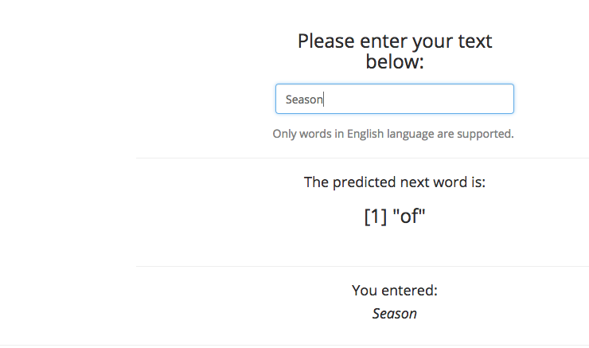

Capstone Project, Final Report
========================================================
author: Carlos Barco-Blanco / cbarco@gmail.com
date: March 22, 2018
autosize: true
font-family: 'Gill Sans MT'
class: illustration

Summary
========================================================
* The aim of this report is to highlight a predictive algorithm, previously developed in a [Milestone Report](http://rpubs.com/cbarco/DSCapstone_Milestone_Report) and to provide a user interface that can be easily accessed using mobile web browsers.

Description of the Web application
========================================================
* The essence of this project is to take a corpus of text and build a predictive tool to present a user with a prediction of the next likely word based on their input.

Instructions
========================================================
* In order to use, and obtain a direct answer to your query, under the "Please enter your text below" title, the User types phrase/words in a input form.
* After a couple of seconds, the web application shows the word that best fits their query.
  

How it works?
========================================================
* The App cleans the input and tokenizes the words.
* The entered word(s) are passed to the prediction algorithm.
* The web application be accessed and used with the following
[link](https://coursera-carlos-barco.shinyapps.io/shinyapp_-_capstone_project/)
* Please refer to the attached ["Release Notes"](https://coursera-carlos-barco.shinyapps.io/shinyapp_-_capstone_project/#tab-9213-2)

We would like to hear from you!
========================================================
* At the moment, we are carrying out a great effort in order to hire personel to develop a more deeper exploratory data analysis, using greater and more complex data sets.
That´s why we take the strategic decision to show you this prototype, in order to freely probe and give us feedback, to get the opinion of the user and reduce our learning curve.
* Questions?, Comments?, Send us an [Email](cbarco@gmail.com) or give us a [Web call](+51971727120).
* Thank you!
