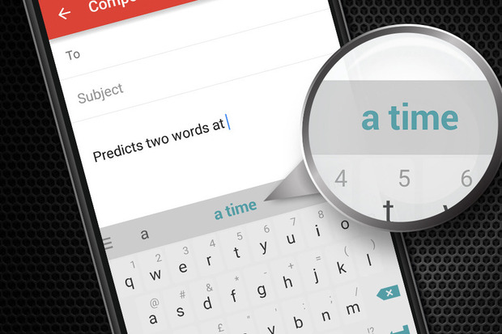

## This is a predictive text web application for the Coursera Data Science Capstone Project.

******
* In Today's world, Natural Language Processing and Predictive Text are getting highly important as world is getting more digital.
________________________________________________________________________________________________
## Objective:
________________________________________________________________________________________________

* The essence of this project is to take a corpus of text and build a predictive model to present a user with a prediction of the next likely word based on their input.
* In this project, I’ll focus on the specific task of prediction implementation made by an algorithm on mobile devices

******
________________________________________________________________________________________________
## How To Use:
________________________________________________________________________________________________

* Type in a word or short phrase into the input text box of the Web app. 
* When you stop typing, the app will run the search in order to activate the prediction algorithm.
* Each time the input changes, the web application will try to make a prediction.

******
________________________________________________________________________________________________
## About the "Corpora":
________________________________________________________________________________________________

* The data used to create a frequency dictionary originated in text a corpus called [HC Corpora](http://data.danetsoft.com/corpora.heliohost.org). 
* 01) Create a sample data set from the [Capstone Dataset](https://d396qusza40orc.cloudfront.net/dsscapstone/dataset/Coursera-SwiftKey.zip)
* 02) Clean the sample (convert it to lowercase, remove punctuation, strip whitespace, remove entities, etc.) 
* 03) Tokensize the sample into N-Grams.
* 04) Take the uni/bi/tri and quadram frequencies and put them into lookup data frames
* 05) Use the data frame to predict the next word in the inputted sequence.

******

________________________________________________________________________________________________
## Definition of N-Grams:
________________________________________________________________________________________________

* What is an N-Gram? -->  [N-Grams](https://stackoverflow.com/questions/18193253/what-exactly-is-an-n-gram). 
* N-grams are simply all combinations of adjacent words or letters of length n that you can find in your source text.

## Comments?
* Please, send me an email to: cbarco@gmail.com